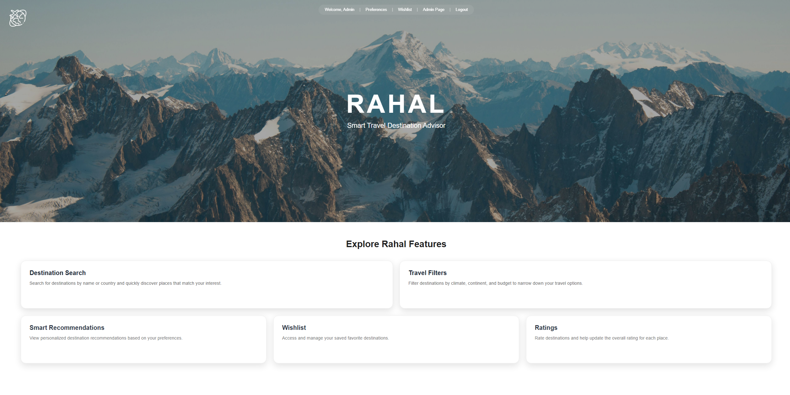
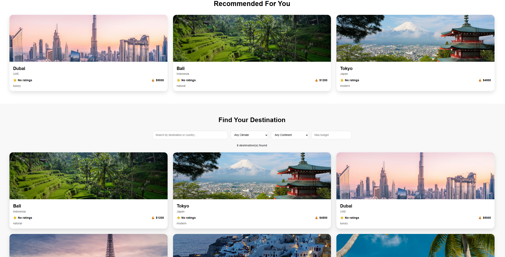
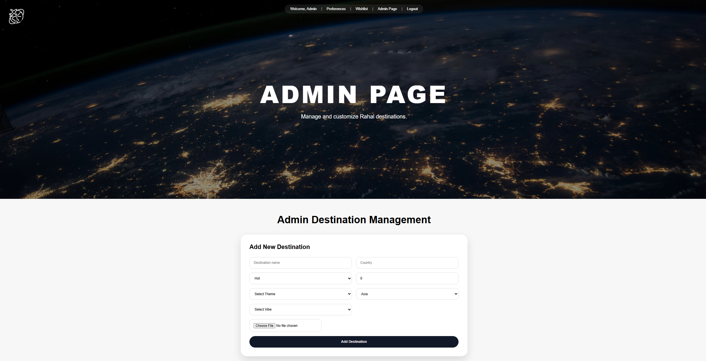

# Rahal Travel Advisor 🌍

Rahal is a Vue 3 + TypeScript travel destination advisor web application that helps users discover destinations based on travel preferences, climate, budget, and travel style.

The project includes personalized recommendations, wishlist management, ratings, destination filtering, and a complete admin management system.

---

# Features ✨

- User signup and login
- Personalized travel preferences
- Smart destination recommendations
- Destination search and filtering
- Wishlist system
- Ratings and reviews
- Admin destination management
- Image upload and validation
- Persistent localStorage data
- Responsive and modern UI

---

# Screenshots 📸

## Home Page


---

## Destination Search & Filters


---

## Login Page


---

## Admin Dashboard


---

# Technologies Used 🛠️

- Vue 3
- TypeScript
- Vite
- CSS
- LocalStorage

---

# Run Locally 🚀

Install dependencies:

```bash
npm install
```

Run development server:

```bash
npm run dev
```

Open in browser:

```text
http://localhost:5173
```

---

# Project Purpose 🎓

This project was developed as a university programming project to demonstrate:

- Frontend development using Vue.js
- Component-based architecture
- State management
- User interaction and validation
- CRUD operations
- Dynamic filtering and recommendation systems
- Reusable UI components
